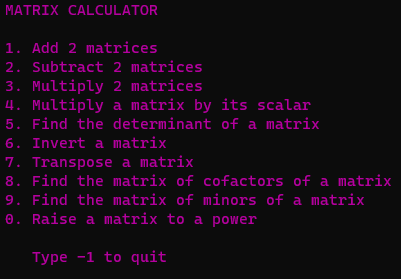
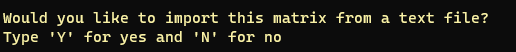
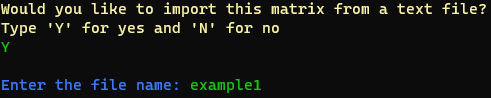
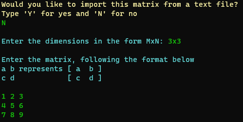
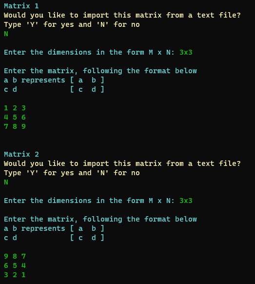
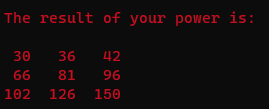
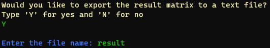

# Matrix Calculator 

## Table of Contents
- [Matrix Calculator](#matrix-calculator)
  - [Table of Contents](#table-of-contents)
  - [About the Project](#about-the-project)
  - [Running the Program](#running-the-program)
  - [Using the Program](#using-the-program)
    - [Menu](#menu)
    - [Import Matrix](#import-matrix)
    - [Inputting A Matrix](#inputting-a-matrix)
    - [Two Matrices](#two-matrices)
    - [Scalar](#scalar)
    - [Result Matrix](#result-matrix)
    - [Export Matrix](#export-matrix)

## About the Project

This calculator allows you to do a multitude of functions, such as operations between two matrices or calculating the properties of a specific matrix.

## Running the Program
Compile the program using `gcc src/*.c src/operations/*.c -o program -lm`.

This wil create the output file `program` (or `program.exe` on Windows) which can then be run to execute the program.

**NOTE:** This program uses ANSI escape sequences to colour-code any text. To disable these, perhaps due to your terminal not supporting them, set the defined variable `COLOUR` to `false` in `src/colour.h` **before** compiling.

## Using the Program

### Menu

Enter the menu option (from 1-9 and 0) of the operation you would like to do.

### Import Matrix

The program will ask you whether youd like to import a matrix from a text file.

Matrix text files are read from the `./data/matrices` folder.

Entering `Y` will prompt you to enter the file to import from. In this screenshot, the program will attempt to import from `./data/matrices/example1`. The program will read the text in the file and convert it to a matrix.

### Inputting A Matrix

Entering `N` will prompt you to enter the matrix yourself.

The program will first ask you for the dimensions of the matrix (in the form `M x N` with `M` representing number of rows and `N` representing the number of columns).

Thee program will then ask you to input each number in the matrix. Splitting the numbers by spaces (for columns) and by newlines (for rows) allows the program to accurately read the matrix.

### Two Matrices

For some operations (such as addition, subtraction and matrix multiplication) require two matrices and hence the program will ask you to input two matrices.

### Scalar

A scalar number is required for two operations:

Scalar Multiplication (any decimal number)

and Raising to a Power (integers only)

In these instances, the program will ask you for a scalar number.

### Result Matrix

For all operations (besides the determinant), the result matrix will be printed and formatted.

### Export Matrix

The program will ask you if you would like to export the matrix. This matrix can be found in `./data/matrices/`. These matrices can then be re-imported in the next or in any future calculations (so long as the file still exists).
